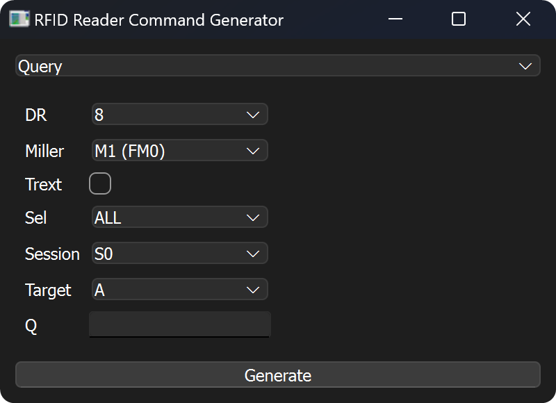

# EPC PHY Layer Signal Generator

This repository contains the source code for the EPC PHY Layer Signal Generator. The EPC PHY Layer Signal Generator is a software tool that generates the baseband signal for the EPC UHF RFID standard.

**[Download (Windows Portable Executable)](https://github.com/clysto/epcphy/releases/latest/download/epcphy.exe)**

